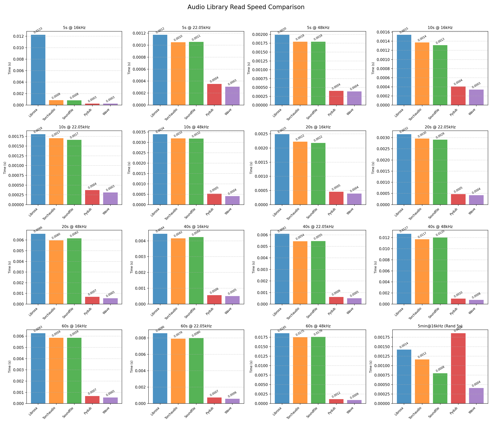

# Audio Library Read Speed Comparison

## Project Overview

This project aims to benchmark and compare the read speed performance of different Python audio processing libraries, helping developers choose the most suitable audio library for their needs.

## Purpose

With the widespread application of audio processing in machine learning, signal processing, and other fields, choosing an efficient audio reading library has become crucial. This project provides objective performance reference data by comparing the read performance of mainstream Python audio libraries.

## Tested Libraries

This project benchmarks the following 5 mainstream Python audio processing libraries:

1. **Librosa** - Professional library for audio and music analysis
2. **Torchaudio** - Audio processing library for PyTorch ecosystem  
3. **Soundfile** - Audio file I/O library based on libsndfile
4. **Pydub** - Simple and easy-to-use audio manipulation library
5. **Wave** - Audio module from Python standard library

## Test Methodology

### Test 1: Complete Audio File Reading
- **Audio Duration**: 5s, 10s, 20s, 40s, 60s
- **Sample Rates**: 16kHz, 22.05kHz, 48kHz
- **Test Method**: Read each configuration 100 times and calculate average time

### Test 2: Random Segment Reading
- **Base File**: 5-minute audio file @ 16kHz
- **Segment Duration**: 5-second random segments
- **Test Method**: Randomly select start positions, repeat 100 times

## Test Results



*The above chart shows the average read time (seconds) for each audio library across different test scenarios*

## Key Findings

Based on the test results, we draw the following key conclusions:

### 🏆 Overall Performance Ranking

1. **Soundfile** - Best overall performance, excelling in most test scenarios
2. **Wave** - Stable performance from standard library, but WAV format only
3. **Torchaudio** - Good performance in certain scenarios, especially suitable for deep learning projects
4. **Librosa** - Feature-rich but relatively slower read speed
5. **Pydub** - Easy to use but average performance

### 📊 Detailed Analysis

- **Short audio files (5-10s)**: Soundfile and Wave perform best
- **Medium-length audio (20-40s)**: Soundfile maintains the lead
- **Long audio files (60s+)**: Soundfile advantage becomes more pronounced
- **High sample rate audio**: Soundfile maintains advantage even at 48kHz
- **Random segment reading**: Soundfile performs best in random access scenarios

### 🎯 Usage Recommendations

- **Performance Priority**: Recommended **Soundfile**
- **Standard Library Requirement**: Choose **Wave** (WAV format only)
- **Deep Learning Projects**: Recommended **Torchaudio** (high integration with PyTorch ecosystem)
- **Audio Analysis Projects**: Choose **Librosa** (most feature-rich)
- **Simple Audio Operations**: Choose **Pydub** (most user-friendly API)

## Usage Instructions

### Requirements

```bash
pip install librosa torchaudio soundfile pydub matplotlib numpy scipy
```

### Running the Test

```bash
python read_speed.py
```

The program will automatically:
1. Generate required test audio files (if they don't exist)
2. Run performance tests
3. Generate result charts
4. Output results in Markdown format

## File Description

- `read_speed.py` - Main test script
- `audio_library_read_speed_comparison.png` - Test result chart
- `audio_*s_*Hz.wav` - Test audio files with different configurations
- `README.md` - Project documentation

## Technical Details

### Test Methodology
- Uses `time.perf_counter()` for high-precision timing
- Each test repeated 100 times for averaging
- Error handling and exception case marking
- Graceful degradation for missing libraries

### Audio File Generation
- Uses 440Hz sine wave to generate test audio
- 16-bit integer format
- Automatically generates combinations of different durations and sample rates

## Contributing

Welcome to submit Issues and Pull Requests to improve test methods or add new test libraries.

## License

MIT License 