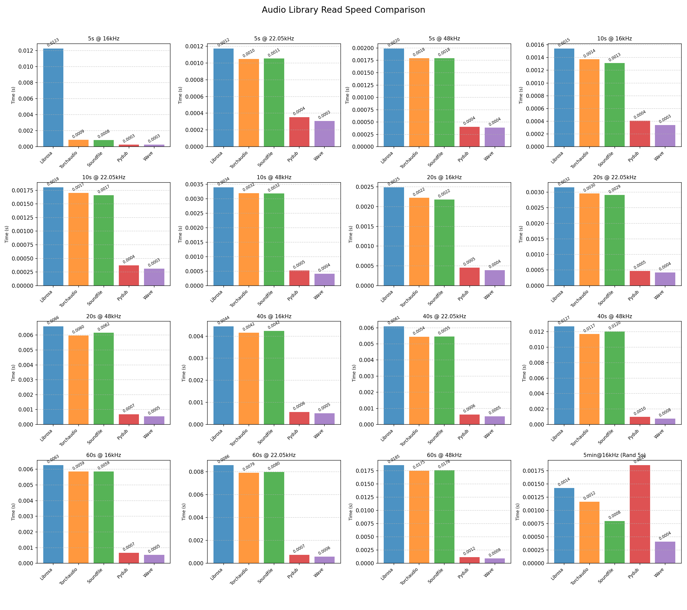

# 音频库读取速度对比测试

[English](README.md) | 中文

## 项目概述

本项目旨在对比测试不同Python音频处理库的读取速度性能，帮助开发者选择最适合的音频处理库。

## 测试目的

随着音频处理在机器学习、信号处理等领域的广泛应用，选择一个高效的音频读取库变得至关重要。本项目通过对比主流Python音频库的读取性能，为开发者提供客观的性能参考数据。

## 测试库

本项目测试了以下5个主流Python音频处理库：

1. **Librosa** - 音频和音乐分析的专业库
2. **Torchaudio** - PyTorch生态系统的音频处理库  
3. **Soundfile** - 基于libsndfile的音频文件读写库
4. **Pydub** - 简单易用的音频操作库
5. **Wave** - Python标准库中的音频模块

## 测试方案

### 测试1：完整音频文件读取
- **音频时长**: 5秒, 10秒, 20秒, 40秒, 60秒
- **采样率**: 16kHz, 22.05kHz, 48kHz
- **测试方法**: 每个配置重复读取100次，计算平均时间

### 测试2：随机片段读取
- **基础文件**: 5分钟@16kHz的长音频文件
- **片段时长**: 5秒随机片段
- **测试方法**: 随机选择起始位置，重复读取100次

## 测试结果



*上图展示了各个音频库在不同测试场景下的平均读取时间（秒）*

## 主要结论

基于测试结果，我们得出以下主要结论：

### 🏆 总体性能排名

1. **Soundfile** - 整体性能最优，在大部分测试场景中表现最佳
2. **Wave** - 标准库表现稳定，但仅支持WAV格式
3. **Torchaudio** - 在某些场景下性能良好，特别适合深度学习项目
4. **Librosa** - 功能丰富但读取速度相对较慢
5. **Pydub** - 使用简单但性能一般

### 📊 详细分析

- **短音频文件（5-10秒）**: Soundfile和Wave表现最佳
- **中等长度音频（20-40秒）**: Soundfile持续领先
- **长音频文件（60秒+）**: Soundfile优势更加明显
- **高采样率音频**: Soundfile在48kHz采样率下仍保持优势
- **随机片段读取**: Soundfile在随机访问场景下性能最佳

### 🎯 使用建议

- **性能优先**: 推荐使用 **Soundfile**
- **标准库需求**: 可选择 **Wave**（仅WAV格式）
- **深度学习项目**: 推荐 **Torchaudio**（与PyTorch生态集成度高）
- **音频分析项目**: 可选择 **Librosa**（功能最丰富）
- **简单音频操作**: 可选择 **Pydub**（API最友好）

## 运行说明

### 环境要求

```bash
pip install librosa torchaudio soundfile pydub matplotlib numpy scipy
```

### 运行测试

```bash
python read_speed.py
```

程序会自动：
1. 生成测试所需的音频文件（如果不存在）
2. 运行性能测试
3. 生成结果图表
4. 输出Markdown格式的结果表格

## 文件说明

- `read_speed.py` - 主测试脚本
- `audio_library_read_speed_comparison.png` - 测试结果图表
- `audio_*s_*Hz.wav` - 不同配置的测试音频文件
- `README.md` - 项目说明文档（英文）
- `README_zh.md` - 项目说明文档（中文）

## 技术细节

### 测试方法
- 使用 `time.perf_counter()` 进行高精度计时
- 每个测试重复100次取平均值
- 错误处理和异常情况标记
- 支持缺失库的优雅降级

### 音频文件生成
- 使用440Hz正弦波生成测试音频
- 16位整型格式
- 自动生成不同时长和采样率的组合

## 贡献

欢迎提交Issue和Pull Request来改进测试方法或添加新的测试库。

## 许可证

MIT License 